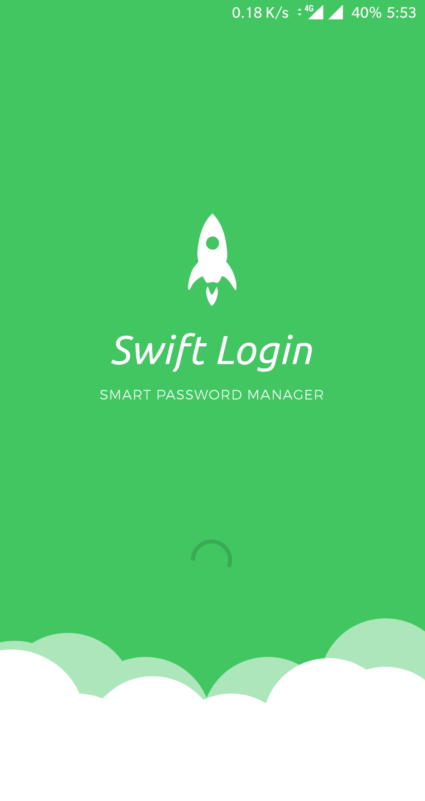

# Swift Login

Swift Login is an android password manager with a unique way to login into websites. Unlike other password managers which encrypt and decrypt plain text passwords using a master password, Swift Login encrypts all the user data using fingerprint and provides a unique mechanism of authentication for online accounts which is highly secure, automatic and faster. 

It eliminates the need for remembering and typing passwords completely and provides a secure environment for users to login into their accounts anywhere quickly by using their mobile.

## Features

* Fingerprint Authentication.
* Built-in web browser for secure login.
* Random Password Generation.
* Login to multiple accounts quickly.
* User data is secured in the local database.
* Transfer sessions to any browser using web extension.

## Need for this kind of password managers

* Protects from Shoulder surfing, CCTV surveillance, hardware and software keyloggers.
